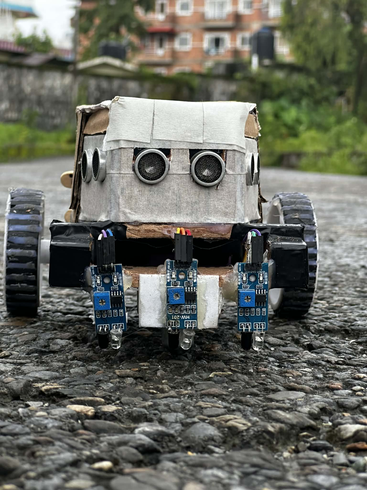
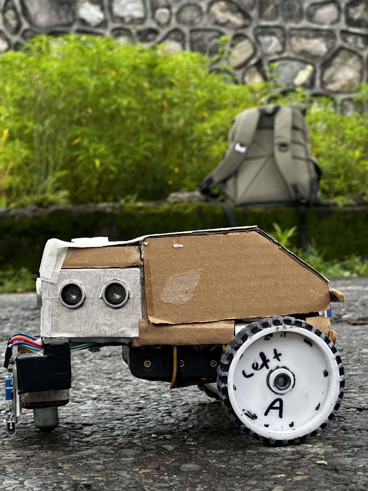
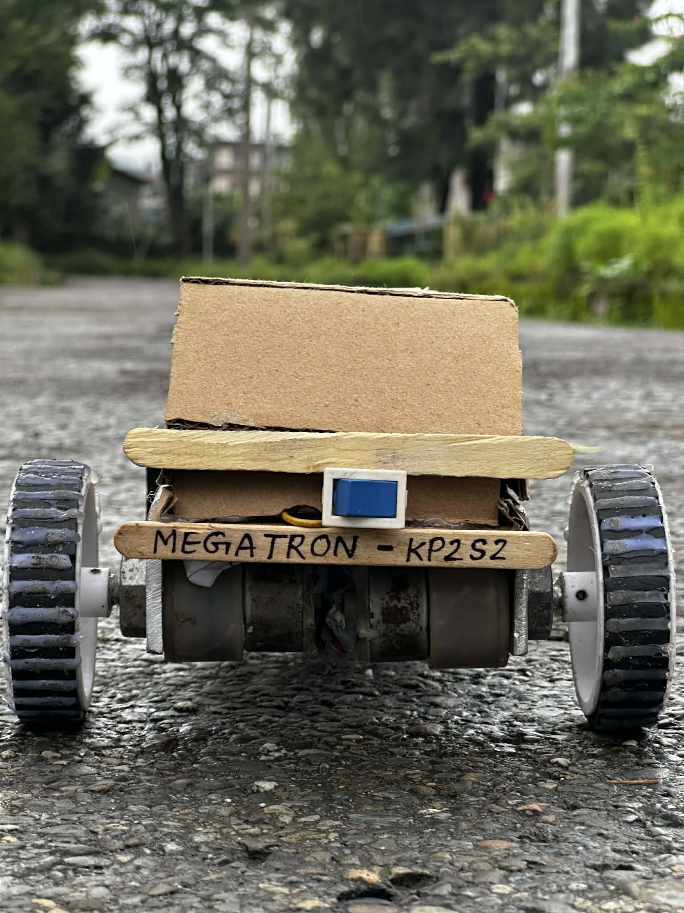

# 🤖 MEGATRON KP2S2 – Line & Wall Following Robot

**MEGATRON KP2S2** is an autonomous robot capable of both **line following** and **wall / obstacle following**. Built using an **Arduino Nano**, IR sensors, and ultrasonic sensors, the robot intelligently switches between modes based on environmental conditions.  
This project was developed by **Team B5, IOE Paschimanchal Campus**, and successfully used in competition.

---

## 🎯 Objectives

- Design a robot that accurately follows a white line  
- Detect loss of line or junctions automatically  
- Switch intelligently to obstacle / wall-following mode  
- Ensure smooth navigation using minimal hardware  
- Maintain clean, modular, and understandable code  

---

## 🛠️ Core Features

### 🧭 Navigation Features
- **Line Following:**  
  Uses three IR sensors (Left, Middle, Right) to track a white line accurately.

- **Wall / Obstacle Following:**  
  Uses three ultrasonic sensors (Front, Left, Right) to maintain safe distance from obstacles.

- **Automatic Mode Switching:**  
  Robot switches from line-following to wall-following when the line is lost—no manual control required.

### ⚙️ Control Features
- Sharp and slight turning logic  
- PWM-based motor speed control  
- Modular motor and sensor functions  

---

## 🧰 Components Used

### 🔌 Electronic Components
- Arduino Nano  
- L298N Motor Driver  
- DC Gear Motors (2)  
- IR Sensors (3)  
- Ultrasonic Sensors (3)  
- 3 × 3.7V Li-ion Batteries (≈11.1V total)  
- Battery Holder  
- Breadboard  
- Jumper Wires  

### 🧱 Mechanical Components
- Wooden Ply Board (Chassis)  
- Wheels (2)  
- Caster Wheel  
- Cardboard (Mounting support)

---

## 🧠 Working Principle

### Line Following Mode
- IR sensors detect reflected infrared light  
- White surface → low IR value  
- Black surface → high IR value  
- Arduino decides movement based on sensor combinations  

### Wall Following Mode
- Activated when all IR sensors lose the line  
- Ultrasonic sensors measure distance using echo timing  
- Robot adjusts direction to avoid obstacles and follow walls  

---

## 💻 Software & Programming

- **IDE:** Arduino IDE  
- **Language:** Arduino C / C++  

### Code Highlights
- Modular motor control functions  
- Sensor-based decision making  
- Automatic behavior switching  
- Separate logic for:
  - Slight turns  
  - Sharp turns  
  - Obstacle avoidance  

> 📂 Full Arduino source code is available in the repository.

---

## 🧪 Testing & Results

- Accurate line following under different lighting conditions  
- Reliable wall-following and obstacle avoidance  
- Smooth automatic mode switching  
- Minor tuning required for sharp corners  

✅ Successfully tested and used in competition  
🏆 Overall Winner

---

## 🚀 Future Improvements

- PID control for smoother line tracking  
- Wheel encoders for precise movement  
- Bluetooth/Wi-Fi monitoring  
- Display for live sensor values  

---

## 👥 Team Members

- **Pawan Tripathi** – Electronics Engineering  
- **Kritan Bastola** – Electronics Engineering  
- **Sumina Chaudhary** – Mechanical Engineering  
- **Swarnim Ranabhat** – Computer Engineering  
- **Prakat Sharma** – Computer Engineering  

### 🎓 Mentor
- **Nikhil Gautam** – Mechanical Engineering  

---

## 📸 Project Preview

### Front View

### Side View

### Back View

---

## 📚 References

- https://www.arduino.cc  
- https://www.geeksforgeeks.org/arduino-coding-basics  
- https://www.tinkercad.com  
- ChatGPT (for text refinement only)

---

## 📌 Conclusion

MEGATRON KP2S2 demonstrates how multiple autonomous behaviors can be combined into a single robotic system using simple sensors and intelligent logic. The project provides a strong foundation for learning autonomous navigation and competitive robotics.
